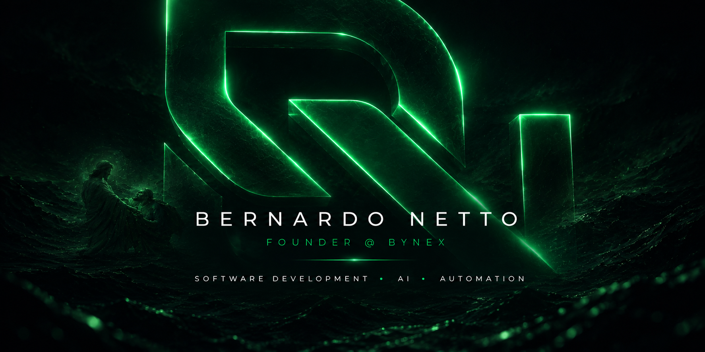

  

---

## 👨‍💻 About Me

<table>
<tr>
<td width="50%" valign="top">

### Who I Am

I'm **Bernardo Netto**, a Software Developer, Computer Science student and Founder of **Bynex**.

I enjoy transforming ideas into real digital products by combining **software development, artificial intelligence and automation**.

My focus is on building technology that is practical, scalable and capable of solving real-world business problems.

</td>

<td width="50%" valign="top">

### What I Build

* SaaS products and platforms
* AI-powered applications
* Business automation
* Internal management systems
* Custom software solutions
* Web applications
* System integrations

</td>
</tr>
</table>

---

## 🏢 Bynex

I'm the Founder of **Bynex**, a technology company focused on creating modern digital solutions, intelligent systems and business automation.

Our goal is to transform business challenges into **practical, efficient and scalable technology**.

<table>
<tr>
<td width="50%" valign="top">

### 🌐 Bynex Web

Modern digital experiences for businesses.

* Websites
* Landing pages
* Business portals
* Web applications
* Digital platforms

</td>

<td width="50%" valign="top">

### ⚙️ Bynex Automation

Technology designed to optimize operations.

* Business process automation
* CRM integrations
* System integrations
* Internal workflows
* Operational automation

</td>
</tr>

<tr>
<td width="50%" valign="top">

### 🧠 Bynex AI

Artificial Intelligence applied to real business needs.

* AI assistants
* Intelligent customer service
* Internal AI tools
* AI integrations
* AI-powered workflows

</td>

<td width="50%" valign="top">

### 💻 Bynex Solutions

Custom technology for specific business challenges.

* Custom software
* Internal systems
* SaaS development
* Technology projects
* Cloud & IT solutions

</td>
</tr>
</table>

### Technology that drives business.

---

## 🎯 Currently Focused On

<table>
<tr>
<td width="50%" valign="top">

### 🚀 Building

- SaaS products & platforms
- AI-powered applications
- Business automation
- Internal management systems

</td>

<td width="50%" valign="top">

### 📚 Exploring

- Software architecture
- Cybersecurity
- AI agents & workflows
- Scalable backend systems

</td>
</tr>
</table>

> Turning ideas into practical digital products — one project at a time.

---
## 🛠️ Tech Stack & Tools

### Languages

  

### Frontend

  

### Backend & Databases

  

### Development & Infrastructure

  

### AI & Automation

---

## 🚀 Featured Projects

### Projects I'm building and developing

<table>
<tr>
<td width="50%" valign="top">

### 🚀 SaaS Platform

Modern SaaS application focused on solving real business problems through a simple and scalable digital experience.

**Focus**

`SaaS` `Web` `Automation` `Business`

> Repository coming soon.

</td>

<td width="50%" valign="top">

### 🤖 AI System

AI-powered solution designed to automate tasks, organize information and improve operational workflows.

**Focus**

`Artificial Intelligence` `Automation` `APIs`

> Repository coming soon.

</td>
</tr>

<tr>
<td width="50%" valign="top">

### ⚙️ Automation Platform

Automation system designed to connect tools, reduce repetitive processes and improve productivity.

**Focus**

`Automation` `Integrations` `Backend`

> Repository coming soon.

</td>

<td width="50%" valign="top">

### 💻 Custom Software

Custom software solution built around a specific operational or business requirement.

**Focus**

`Software` `Systems` `Architecture`

> Repository coming soon.

</td>
</tr>
</table>

> As my public repositories evolve, this section will be updated with demos, screenshots, documentation and source code.

---

## 📊 GitHub Activity

 

---

## 🧠 Development Philosophy

> Build useful things.
> Automate what can be automated.
> Keep learning.
> Turn ideas into products.

I believe technology should go beyond writing code.

My goal is to understand problems, design solutions and build software that provides real value to people and businesses.

---

## 🤝 Let's Connect

I'm interested in technology, software development, AI, automation, SaaS and innovative digital products.

If you're working on something interesting or want to exchange ideas, feel free to reach out.

---

### Bernardo Netto

**Founder @ Bynex • Software Developer • AI & Automation**

 

`Building • Learning • Automating • Creating`

